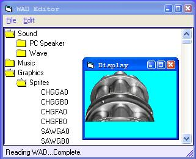



## WAD Editor

### Description

Basis for I/O to Doom, Doom 2, Heretic, and Hexen WAD files. Based on the specifications given by The Unoffical Doom Specs by Matthew S Fell. Features reading of lumps on demand or all at once (VB seems to handle a 17MB IWAD fine, kinda slow though). Currently supports the convertion of lumps to and from WAV files and graphics previewing. And if that's not enough, it features an advanced catergorized lump tree builder. I'm working on improving graphics convertions (importing/exporting BMPs for one thing), MUS<->MID conversion, and maybe something to do with maps.
 
### More Info
 

             |
---                |---
**Submitted On**   |2003-12-04 18:51:00
**By**             |[Keith Weimer](https://github.com/Planet-Source-Code/PSCIndex/blob/master/ByAuthor/keith-weimer.md)
**Level**          |Intermediate
**User Rating**    |5.0 (10 globes from 2 users)
**Compatibility**  |VB 5\.0, VB 6\.0
**Category**       |[Games](https://github.com/Planet-Source-Code/PSCIndex/blob/master/ByCategory/games__1-38.md)
**World**          |[Visual Basic](https://github.com/Planet-Source-Code/PSCIndex/blob/master/ByWorld/visual-basic.md)
**Archive File**   |[WAD\_Editor1681291272003\.zip](https://github.com/Planet-Source-Code/keith-weimer-wad-editor__1-47766/archive/master.zip)

